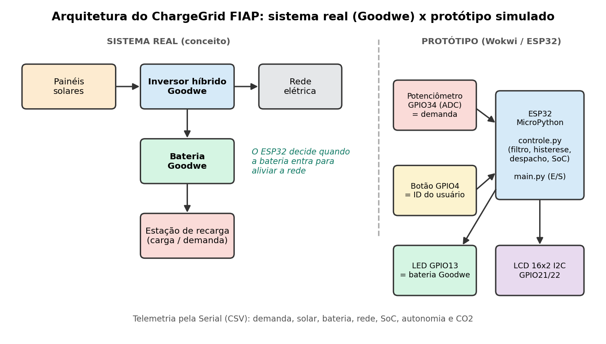
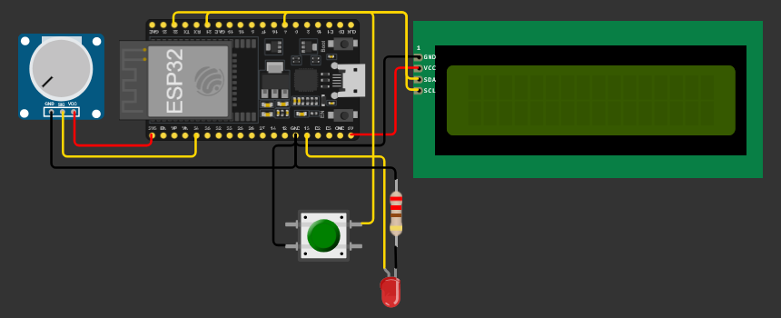
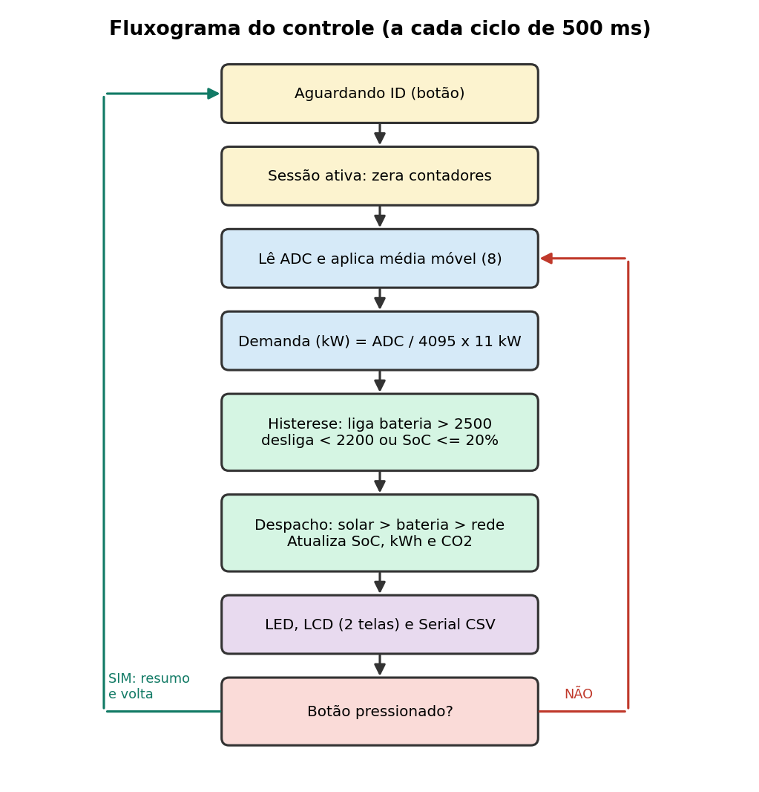
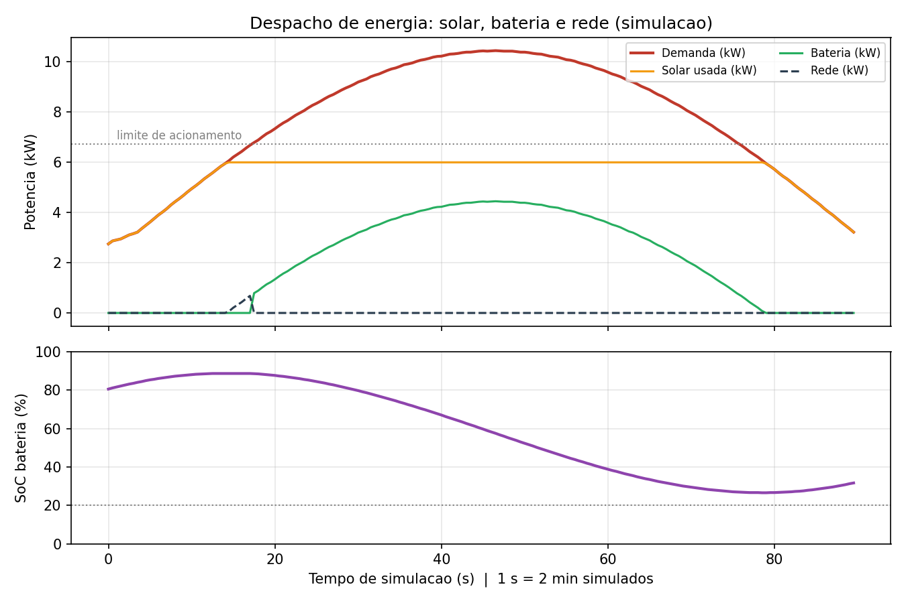

# ChargeGrid FIAP

**Sprint 4 – Solução Final Integrada e Inovadora Goodwe**

Estação de recarga inteligente que decide, em tempo real, como atender a demanda de energia: **primeiro solar, depois a bateria Goodwe e, por último, a rede elétrica**. Protótipo em **ESP32 + MicroPython**, simulado no **Wokwi**.

[ Simular no Wokwi](https://wokwi.com/projects/476802909288083457) · [ Vídeo de demonstração](LINK_DO_VIDEO_YOUTUBE) · [ Documento PDF](Sprint4_ChargeGrid_FIAP.pdf)

---

##  Integrantes

| Nome | RM |
|------|----|
| Eduardo Barcelos De Carvalho Braziliano | 573274 |
| Julia Johanson Peniche Dias Da Silva | 572220 |
| Lucas Bomfim Leite | 570420 |

---

##  Problema e solução

Vários veículos elétricos carregando ao mesmo tempo geram picos de demanda que sobrecarregam a rede. O ChargeGrid FIAP gerencia esse pico:

1. O usuário se identifica (simulado por um botão) e a sessão começa.
2. A demanda da estação (simulada por um potenciômetro) é medida e filtrada.
3. A **energia solar** atende a demanda primeiro; o excedente carrega a **bateria**.
4. Quando a demanda passa do limite, a **bateria Goodwe é acionada** (LED aceso) para aliviar a rede, respeitando uma reserva mínima de 20%.
5. O display mostra demanda, estado da bateria, uso da rede e CO₂ evitado; a Serial emite telemetria em CSV.



##  Alinhamento com o desafio Goodwe

| Requisito | Como é atendido |
|-----------|-----------------|
| Geração, armazenamento e uso de energia renovável com monitoramento inteligente | Despacho solar → bateria → rede, com SoC, kWh e autonomia calculados a cada ciclo |
| Tecnologia compatível com Goodwe | LED/estado "BAT ON" representa o acionamento da bateria do sistema híbrido Goodwe |
| Algoritmos inteligentes e automação | Média móvel, histerese, reserva mínima de SoC e despacho por prioridade |
| Interface amigável e visualização de dados | LCD com 2 telas alternadas + telemetria CSV e gráficos |
| Impacto (eficiência, carbono, relevância social) | Redução do pico na rede e estimativa de CO₂ evitado por sessão |

##  Hardware (Wokwi)

| Componente | Pino ESP32 | Função |
|------------|-----------|--------|
| Potenciômetro | GPIO34 (ADC) | Demanda simulada (0–11 kW) |
| Botão | GPIO4 (PULL_UP) | ID do usuário: inicia/encerra a sessão |
| LED vermelho + 220 Ω | GPIO13 | Bateria Goodwe acionada |
| LCD 16x2 I2C (0x27) | SDA 21 / SCL 22 | Interface com o usuário |



##  Como funciona



A cada ciclo de 500 ms (`codigo/controle.py`):

- **Filtro:** média móvel de 8 amostras do ADC.
- **Decisão com histerese:** bateria liga acima de `2500` (≈ 61% / 6,7 kW) e desliga abaixo de `2200` ou com SoC ≤ 20%.
- **Despacho:** solar → bateria → rede; atualização de SoC, energia (kWh), autonomia e CO₂ evitado.
- **Aceleração de tempo:** 1 s real = 2 min simulados, para o SoC variar de forma visível.

### Telas do LCD

| Momento | Linha 1 | Linha 2 |
|---------|---------|---------|
| Aguardando | `ChargeGrid FIAP` | `Aguardando ID...` |
| Sessão (tela 1) | `Dem: 66%  7.3kW` | `BAT ON  SoC: 84%` |
| Sessão (tela 2) | `Rede 0.0 Sol 6.0` | `CO2 evit  0.05kg` |
| Encerramento | `Sessao encerrada` | `Autonomia  99%` |

### Telemetria (Serial)

```
t_s,adc,demanda_kw,solar_kw,bateria_kw,rede_kw,bat_on,soc_pct,autonomia_pct,co2_kg
```

##  Resultados

Perfil de demanda reproduzível (potenciômetro de ≈ 25% → 95% → 25% em 90 s, equivalente a 3 h simuladas), executado por `simulacao/simular_perfil.py`:

| Indicador | Valor |
|-----------|-------|
| Energia demandada | 22,86 kWh |
| Solar / Bateria / Rede | 16,63 / 6,20 / 0,04 kWh |
| Autonomia renovável | 99,8% |
| Pico na rede sem bateria | 4,45 kW |
| Pico na rede com ChargeGrid | 0,68 kW (**−84,7%**) |
| SoC da bateria | 80% → 31,7% (reserva de 20% preservada) |
| CO₂ evitado (premissa 0,0385 kg/kWh) | 0,88 kg |



>  Potências, capacidade da bateria e fator de CO₂ são **premissas de simulação** (ajustáveis em `controle.py`), não medições de equipamento real.

##  Como executar

**No Wokwi (recomendado)**
1. Abra o [projeto no Wokwi](https://wokwi.com/projects/476802909288083457).
2. Garanta que existem os arquivos `main.py`, `controle.py`, `lcd_api.py`, `machine_i2c_lcd.py` e `diagram.json` (copie de `codigo/`).
3. Clique em ▶, pressione o botão verde para iniciar a sessão e gire o potenciômetro. Pressione o botão novamente para encerrar.

**Simulação em Python (sem hardware)**
```bash
pip install matplotlib   # opcional, para gerar o gráfico
python simulacao/simular_perfil.py
```

##  Estrutura do repositório

```
├── README.md
├── Sprint4_ChargeGrid_FIAP.pdf
├── codigo/
│   ├── main.py               # E/S: botão, ADC, LED, LCD, Serial
│   ├── controle.py           # lógica de controle (testável sem hardware)
│   ├── lcd_api.py            # biblioteca LCD
│   ├── machine_i2c_lcd.py    # driver LCD I2C
│   ├── diagram.json          # circuito do Wokwi
│   └── wokwi-project.txt
├── simulacao/
│   ├── simular_perfil.py
│   └── dados_simulacao.csv
└── docs/                     # diagramas, circuito e gráfico
```

##  Avaliação crítica

**Pontos fortes:** separação entre controle e hardware; filtro, histerese e reserva de bateria; telemetria e métricas de sustentabilidade por sessão.

**Limitações:** demanda e ID são simulados; geração solar constante; sem integração real com equipamentos Goodwe; fator de CO₂ é premissa.

**Próximos passos:** leitura de dados reais do inversor (Modbus/API), previsão de geração e tarifa horária, autenticação RFID/QR, MQTT + dashboard e assistente virtual.

##  Tecnologias

ESP32 DevKit C v4 · MicroPython 1.21 · Wokwi · LCD 1602 I2C · Python 3 · matplotlib · GitHub

---
*Projeto acadêmico – FIAP. Valores de energia e emissões são simulados.*
